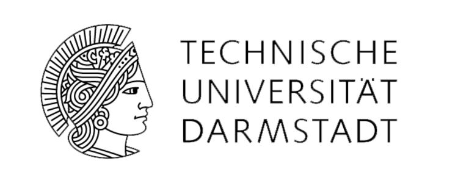
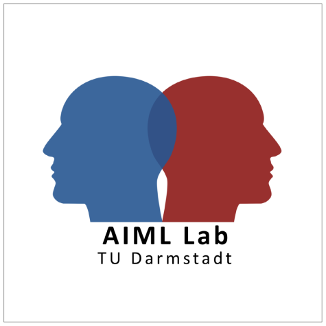
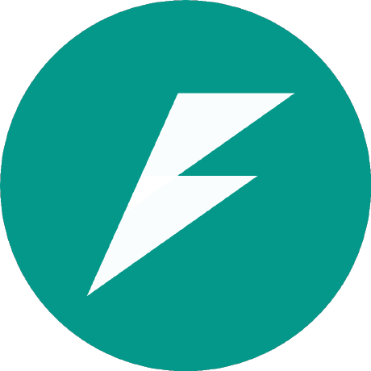
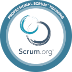

<h1 align="center">Hi 👋, I'm Ali</h1>

## 👀 INTERESTS
**Python**, **Machine Learning** and **Generative AI**. I’m particularly excited about applying NLP techniques to automate and enhance business processes, such as creating **RAG systems**.

## 🤝 Looking for Opportunities

I’m passionate about **innovation**, **collaboration**, and **continuous learning**. I’m currently seeking a **dynamic role in Python/AI** where I can contribute to groundbreaking advancements and be part of forward-thinking teams.

___

## 💼 EXPERIENCES

I bring several years of experience in both **development** (including Python programming for Generative AI, RAG systems, and data analysis) and **support** roles (Cloud Administration and Network Engineering).

___

## 🎓 EDUCATION

**M.Sc. in Computer Science, Internet and Web-based Systems**     [Technical University of Darmstadt](https://www.tu-darmstadt.de)  

📝 **Thesis:**  At the [ **AIML Lab**](https://ml-research.github.io), I explored **Responsible Generative AI**, focusing on the **ethical and safety aspects** of large-scale vision datasets. I used **multimodal models** like **CLIP** and **LLaVA** to control **diffusion models** in the **latent space** via **prompt translation**.  
🔗 [Read more](https://github.com/alikhalajii/diffBased-DSAug-Safety)

**B.Sc. in Computer Science, Software Engineering**      [Islamic Azad University, Tehran Branch](https://ctb.iau.ir/eng/en)

📝 **Thesis:**  Developed a **Virtual University System** software model using **UML** and **RUP**, focusing on creating a scalable and maintainable architecture through structured diagrams defining **structure**, **behavior**, and **interactions**.

___

<h3 align="left">⚡ TOP SKILLS AND TOOLS</h3>

  
  
  
  
  
  
  
  
  
  
  
  

___

## 🌐 LANGUAGES I SPEAK:

___

## 🤝 LET'S CONNECT!

It seems you're really interested in learning more – I'm glad you're here! Feel free to reach out, and let’s connect and chat.

  
  
  

